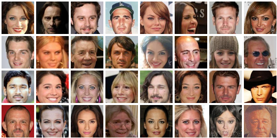
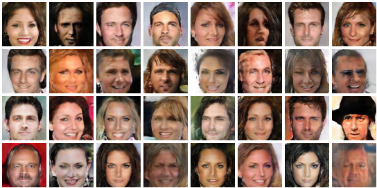

# Overview
PyTorch implementations of various generative models to be trained and evaluated on **CelebA** dataset. The models are: *Deep Convolutional GAN, Least Squares GAN,
Wasserstein GAN, Wasserstein GAN Gradient Penalty, Information Maximizing GAN, Boundary Equilibrium GAN, Variational AutoEncoder and Variational AutoEncoder GAN*.
All models have as close as possible nets architectures and implementations with necessary deviations required by their articles.

For now all models except InfoGAN are **conditional** on attributes, with attributes vector concatenated to latent variable for generator and to
channels for discriminator. However if desired conditionality can be easily removed.

Most of the code is shared between the models, so adding a model, changing models architectures or usage on different dataset all require little effort.
As most GANs differ only in the way generator and discriminator losses are computed adding a model might only require to inherit from GAN superclass and provide losses.

For visual control during training *Visdom* is used and requires only to provide values and images interested in. 

# Usage
[Celeba dataset link](http://mmlab.ie.cuhk.edu.hk/projects/CelebA.html)

For usage data folder should be organized in the following way
```
    data
    ├── list_attr_celeba.csv
    └── img_align_celeba
        ├── 000001.jpg
        ├── 000002.jpg
        └── ...
```
To initialize an environment:
```
python -m venv env  
. env/bin/activate  
pip install -r requirements.txt  
```
To train a model:
```
visdom -p 8889  # in different terminal
python train.py --type=WGANGP --batch_size=64 --lr=0.0001 --n_critic=5 --n_epoch=40 --chkp_freq=10 --plot_freq=100 
```
To continue training:
```
python train.py --type=WGANGP --preload_model=True --start_epoch=40 --batch_size=128 --lr=0.00002 --n_critic=5 --n_epochs=40
```
For help:
```
python train.py --help
```

# Comments on models and results
All models share architecture of *DCGAN* with slight deviations and were trained using Adam(0.5, 0.999) with batch size of 64 and learning rate of 0.0001.

Most models were not trained long enough.

Latent dimension is 128 for all models and models are conditioned on 40 binary attributes such as: 'bald', 'eyeglasses', 'male', etc.

Epochs count is based on discriminator steps (number of generator steps for Wassertein and non-Wassertein GANs differ greatly during one epoch).

## DCGAN
[Unsupervised Representation Learning with Deep Convolutional Generative Adversarial Networks](https://arxiv.org/abs/1511.06434)

Learning rate of 0.0001 and 2 generator steps per discriminator step provided better results.


## LSGAN
[Least Squares Generative Adversarial Networks](https://arxiv.org/abs/1611.04076)

a = -1, b = 1, c = 0

Learning rate of 0.0001 and 2 generator steps per discriminator step.

Had slightly more stable training then DCGAN.


## WGAN
[Wasserstein GAN](https://arxiv.org/abs/1701.07875)

Learning rate of 0.0001 and 5 discriminator steps per generator step.


## WGANGP
[Improved Training of Wasserstein GANs](https://arxiv.org/abs/1704.00028)

lambda = 10

Learning rate of 0.0001 and 5 discriminator steps per generator step.


## InfoGAN
[InfoGAN: Interpretable Representation Learning by Information Maximizing Generative Adversarial Nets](https://arxiv.org/abs/1606.03657)

lambda = 1

Learning rate of 0.0001 and 2 generator steps per discriminator step.

In contrast to other models this one was not trained with conditional attributes. Instead they were used as binomial latent variables. Their true distribution was used as prior for fake images attributes, however their real meaning was to be understood by the model.


### TODO
Check whether attributes really got their true interpretation.

## BEGAN
[BEGAN: Boundary Equilibrium Generative Adversarial Networks](https://arxiv.org/abs/1703.10717)

gamma=0.5, lambda=0.01

Learning rate of 0.0001 and 2 generator steps per discriminator step.

Skip-connections proposed by the authors of the article were not introduced here. As this would require to heavily modify the nets architectures.
The model experienced heavy mode-collapsing. Authors suggest to reduce learning rate to avoid it. This was not tried.


## VAE
[Auto-Encoding Variational Bayes](https://arxiv.org/abs/1312.6114)

Learning rate of 0.0001.


## VAEGAN
[Autoencoding beyond pixels using a learned similarity metric](https://arxiv.org/abs/1512.09300)

gamma=0.01

Learning rate of 0.0001 and 2 generator steps per discriminator step.

Generator loss was changed to exploit log(1-x) -> -log(x) trick. It slightly losses probabilistic interpretation, 
but at least it is able to train this way.

(Epochs count is based on generator steps)

### Real and decoded





# TODO

* Retrain models for better results as most of them were not trained long enough
* Inspect latent dimensions
* Untie models from CelebA dataset
* Add various tricks to stabilize training
* Add dataset download script

Any contributions are very welcome!
